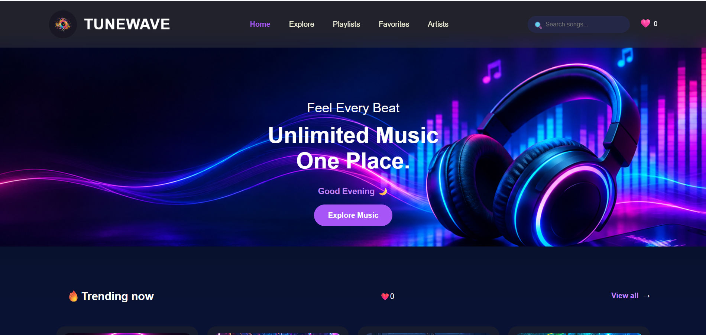
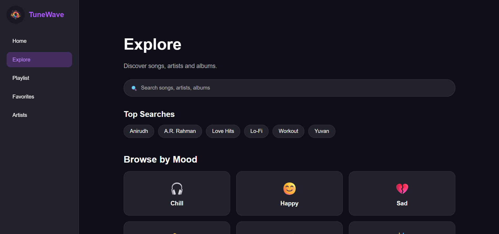
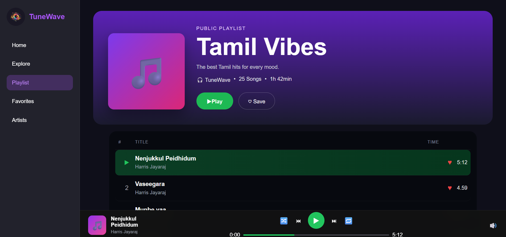
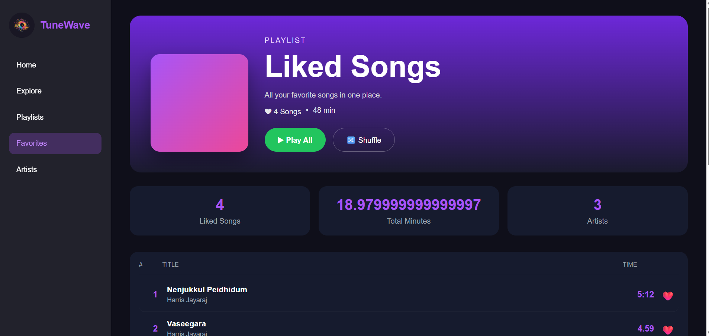

# 🎵 TuneWave – Music Streaming Website

A modern and responsive **music streaming website** built using **HTML, CSS, and JavaScript**. TuneWave allows users to explore songs, play music, like their favorite tracks, browse artists, and enjoy a clean Spotify-inspired interface.

---

## 📖 Project Overview

**TuneWave** is a front-end music player website designed to provide an interactive music listening experience. The project focuses on responsive design, audio playback, playlist management, favorites using Local Storage, and a modern glassmorphism user interface.

---

## ✨ Features

* 🎧 Play, Pause, Next & Previous songs
* ❤️ Like & Unlike songs
* 📂 Favorites playlist using Local Storage
* 🎵 Multiple playlists
* 👨‍🎤 Artists page
* 🔍 Explore music section
* 📱 Fully responsive design
* 🌈 Glassmorphism UI with purple theme

---

## 📄 Website Pages

### 🏠 Home

Landing page with hero banner, featured songs, search bar, and quick navigation.

### 🔍 Explore

Browse songs, discover music, and explore different collections.

### 🎶 Playlists

Listen to curated playlists with an integrated audio player and playback controls.

### ❤️ Favorites

Automatically stores liked songs using **Local Storage** and displays them in the Liked Songs page.

### 👨‍🎤 Artists

Showcases popular Tamil artists and featured music collections.

---

## 🛠 Technologies Used

* **HTML5** – Website structure
* **CSS3** – Styling & Responsive Design
* **JavaScript** – Audio Player, Local Storage & Interactivity

---

## 🎯 Key Functionalities

* Audio playback with custom controls
* Dynamic song switching
* Progress bar updates
* Like button with Local Storage
* Responsive sidebar navigation
* Playlist & Favorites synchronization

---

## 📸 Website Screenshots

### 🏠 Home Page



### 🔍 Explore Page



### 🎶 Playlists Page



### ❤️ Favorites Page



### 👨‍🎤 Artists Page


---

## 📁 Project Structure

```text
TuneWave/
│── home.html
│── explore.html
│── playlists.html
│── favorites.html
│── artists.html
│── audio/
│── images/
│── README.md
```

---

## 🚀 Future Enhancements

* User login & authentication
* Dark / Light mode
* Volume control & seek bar improvements
* Recently played songs
* Music categories & search filtering
* Backend integration with database

---

## 👩‍💻 Author

**Jaya Sri**

B.Sc. Information Technology

Java Full Stack Developer
